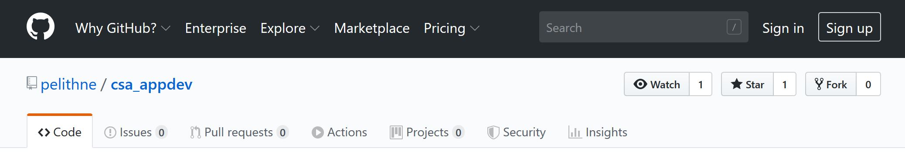
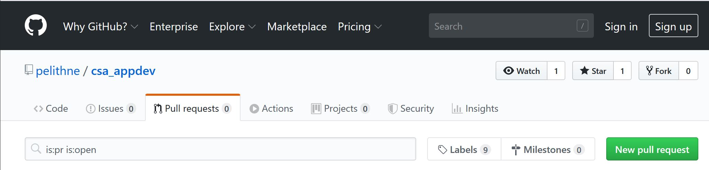

# How we use git

Lets use a workflow where master is the development branch, but as stable as possible.

## Setup
To start work on a project first checkout the original:

````bash
git clone https://github.com/pelithne/csa_appdev.git
````

To start hacking, you need to fork the repo to your own account on Github. Use the **Fork** button in the top right corner on github to create the fork.  

<p align="left">
  
</p>

It´s a good idea to use the name of the fork owner as the remote name

````bash
git remote add kalle git@github.com:kalle/csa_appdev.git
````

````git remote -v```` should print something like

````bash
kalle git@github.com:kalle/csa_appdev.git (fetch)
kalle git@github.com:kalle/csa_appdev.git (push)
origin git@github.com:pelithne/csa_appdev.git (fetch)
origin git@github.com:pelithne/csa_appdev.git (push)
````

## Work
All development should happen in feature branches. Use an understandable name for the branch (e.g. the name of the feature you are implementing).

The following will first fetch the latest changes, to make sure you are working from the most up to date version, and then create a branch.

````bash
git pull
git checkout -b the_cool_heartbeat_feature
````

Start working on the branch and make local commits to it. Write decent commit messages (or you will be sorry later...)

````bash
git commit -m "Fix bug in heartbeat monitor reader"
````

When you want to push your branch to your remote, when its time to create a Pull Request, do so with the -u option:

````bash
git push -u kalle the_cool_heartbeat_feature
````

This is only necessary the first time, after that a normal `git push` will do.

After all work is done make sure to fetch and rebase on top of master to be current:

````bash
git fetch origin
git rebase origin/master
````

If you are unlucky, you will have some conflicts when your commits are introduced into the latest master. You need to handle those conflicts before you can create a **Pull Request** (there are tools for this, like git mergetool).

When done, use the Pull Request tool in github to create the PR. First click on **Pull Requests** in the toolbar, and the click on the green **Pull Request** button

<p align="left">
  
</p>

Make sure to use your branch as the source, and **master** as your destination.

## Reviewing

Ideally someone should approve the PR with a **thumbs up** or similar, before merging (but this is not NASA, so who cares...)

Once approved (ideally by someone who is not YOU), merge the PR into master.

## Clean up
After the PR is merged it is a good idea to checkout the master branch again and do ````git pull``` to make sure you have all the latest code (including your new changes). Then delete your local branch to keep things nice and tidy.

````bash
git checkout master
git pull
git branch -d the_cool_heartbeat_feature
````